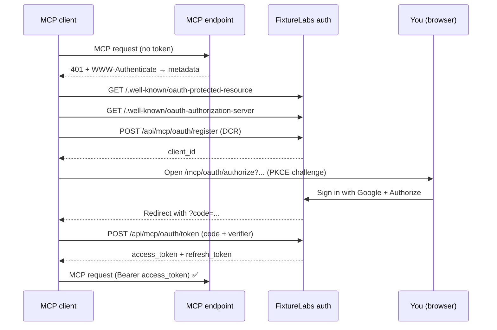

The FixtureLabs MCP server is a **protected resource**. Every request to the MCP
endpoint must carry a valid bearer token; a tokenless request is rejected with
`401 Unauthorized` and a `WWW-Authenticate` header that points clients at the
server's metadata. That 401 is exactly what kicks off the OAuth flow in a
compliant client.

Authentication follows **OAuth 2.1**: Authorization Code grant with **PKCE
(S256)**, **public clients** (no client secret), and **Dynamic Client
Registration** so any client can onboard itself. You sign in with your existing
FixtureLabs Google account and approve access on a consent screen.

<Info>
You rarely run these steps by hand. MCP clients (Claude, Cursor, `mcp-remote`)
perform the whole handshake for you. This page explains what's happening so you
can build a client or debug one.
</Info>

## The flow at a glance



## Step by step

<Steps>
  <Step title="Discovery">
    The client fetches two well-known documents:
    - `/.well-known/oauth-protected-resource` — declares this resource and which
      authorization server protects it.
    - `/.well-known/oauth-authorization-server` — lists the `authorize`, `token`,
      and `register` endpoints, supported scopes, and that only **PKCE S256** and
      **public** clients are accepted.
  </Step>
  <Step title="Dynamic Client Registration">
    The client `POST`s its name and `redirect_uris` to
    `/api/mcp/oauth/register` and receives a `client_id`. No secret is issued —
    clients are public and rely on PKCE. Redirect URIs must be **HTTPS**, or
    **HTTP on a loopback host** (`localhost`, `127.0.0.1`, `::1`) for local apps.
  </Step>
  <Step title="Authorization + consent">
    The client opens `/mcp/oauth/authorize` in a browser with a PKCE
    `code_challenge`. You sign in with Google if needed, then see a consent card
    showing the requesting app, the account you're authorizing as, and the
    redirect target. Approve to continue.
  </Step>
  <Step title="Code exchange">
    On approval the server redirects back with a short-lived `code`. The client
    `POST`s that code plus its PKCE `code_verifier` to `/api/mcp/oauth/token` and
    receives an **access token** and a **refresh token**.
  </Step>
  <Step title="Authenticated calls">
    The client sends `Authorization: Bearer <access_token>` on every MCP request.
    The server validates the token, resolves your identity, and enforces each
    tool's scope requirements.
  </Step>
</Steps>

## Tokens and lifetimes

| Token | Prefix | Lifetime | Purpose |
| --- | --- | --- | --- |
| Authorization code | `fxt_mcp_ac_` | 60 seconds, single-use | Exchanged once for tokens |
| Access token | `fxt_mcp_` | 1 hour | Sent as the bearer on MCP calls |
| Refresh token | `fxt_mcp_rt_` | 30 days | Exchanged for a new access token |

- **Refresh rotation** — each refresh returns a new access token *and* a new
  refresh token; the old refresh token is revoked. Store the latest one.
- **Single-use codes** — an authorization code can be redeemed exactly once and
  expires after 60 seconds. Replays are rejected.
- **At rest** — tokens are never stored in plaintext. The server keeps only a
  salted SHA-256 hash, so a database leak can't reveal usable tokens.

## What "authenticated" gates

There are two distinct checks. Don't confuse them:

1. **Endpoint authentication** — a valid, unexpired, unrevoked token is required
   to reach *any* tool. This is enforced at the HTTP boundary.
2. **Per-tool authorization** — individual tools may additionally require your
   token to resolve to a real user, and some require a specific
   [scope](/authentication/scopes) (for example `blog:write` for
   `create_blog_post`).

Tools documented as "public" still need a valid token to call — "public" only
means they don't read your user identity or require a scope.

## Refreshing

When the access token expires, exchange the refresh token for a new pair:

```bash
curl -sS https://app.fixturelabs.io/api/mcp/oauth/token \
  -H "Content-Type: application/x-www-form-urlencoded" \
  -d "grant_type=refresh_token" \
  -d "refresh_token=fxt_mcp_rt_xxxxxxxx" \
  -d "client_id=YOUR_CLIENT_ID"
```

A revoked, expired, or already-rotated refresh token returns `invalid_grant` — at
that point the client must run the authorization flow again.

## Next

<CardGroup cols={2}>
  <Card title="Scopes & permissions" icon="shield-halved" href="/authentication/scopes">
    What each scope grants and which tools require them.
  </Card>
  <Card title="Endpoint reference" icon="server" href="/authentication/endpoints">
    Exact request/response shapes for every OAuth endpoint.
  </Card>
</CardGroup>
