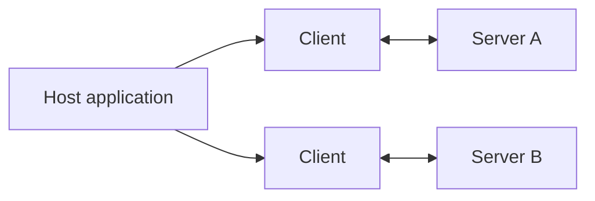

MCP follows a **client-server** model with three roles:

- **Host** — the AI application the user interacts with (e.g., an IDE or chat app).
- **Client** — a connector inside the host that maintains a 1:1 session with a server.
- **Server** — a process that exposes tools, resources, and prompts.

## Lifecycle

1. **Initialize** — client and server exchange capabilities and protocol version.
2. **Operate** — the host issues requests (list tools, call tool, read resource).
3. **Shutdown** — the session closes cleanly.

## Messages

All messages are JSON-RPC 2.0. The three message types are:

- **Requests** — expect a response.
- **Responses** — success or error replies.
- **Notifications** — fire-and-forget events.