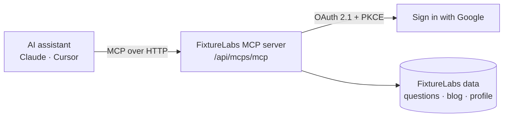

The **FixtureLabs MCP server** lets AI assistants — Claude, Cursor, and any
[Model Context Protocol](https://modelcontextprotocol.io) client — work with your
FixtureLabs account directly. Once connected, an assistant can pull a practice
question to work through with you, read the blog, look up your profile, or draft a
new blog post on your behalf.

It is a remote MCP server: there is nothing to install or run. You point your
client at one URL and sign in with your existing FixtureLabs (Google) account.

<Info>
**Server endpoint**

```
https://app.fixturelabs.io/api/mcps/mcp
```

Transport is **Streamable HTTP**. Authentication is **OAuth 2.1** — your client
walks you through a browser sign-in the first time it connects.
</Info>

## What you can do

<CardGroup cols={2}>
  <Card title="Practice questions" icon="ruler-combined" href="/tools/practice-questions">
    Fetch a random unsolved question — or a specific one — across CAD, DFM,
    fundamentals, and calculations. The answer key is never exposed.
  </Card>

  <Card title="Blog posts" icon="newspaper" href="/tools/blog-posts">
    List and read published posts, or create a new draft post attributed to your
    account for an admin to review.
  </Card>

  <Card title="Your profile" icon="user" href="/tools/utility">
    Read the profile behind the connected account — name, email, username, role,
    and member-since date.
  </Card>

  <Card title="Health check" icon="heart-pulse" href="/tools/utility">
    A simple <code>ping</code> tool to confirm the connection is live.
  </Card>
</CardGroup>

## How it fits together



- Your **client** speaks MCP to the server and handles the OAuth handshake for you.
- The **server** validates the access token, checks the tool's required scope, and
  applies the same access rules the FixtureLabs website uses.
- **You** stay in control: tools that touch your account require a signed-in token,
  and you explicitly approve access on a consent screen.

## Who this is for

- **FixtureLabs users** who want to practice or browse content from inside an AI
  assistant.
- **Developers** building agents or integrations on top of FixtureLabs data.

## Next steps

<CardGroup cols={2}>
  <Card title="Quickstart" icon="bolt" href="/quickstart">
    Connect a client and make your first tool call in a few minutes.
  </Card>

  <Card title="Authentication" icon="key" href="/authentication/overview">
    Understand the OAuth 2.1 flow, tokens, and scopes.
  </Card>

  <Card title="Tools reference" icon="wrench" href="/tools/overview">
    Every tool, its inputs, outputs, and auth requirements.
  </Card>

  <Card title="Architecture" icon="sitemap" href="/reference/architecture">
    Transport, request lifecycle, and the pieces behind the server.
  </Card>
</CardGroup>
