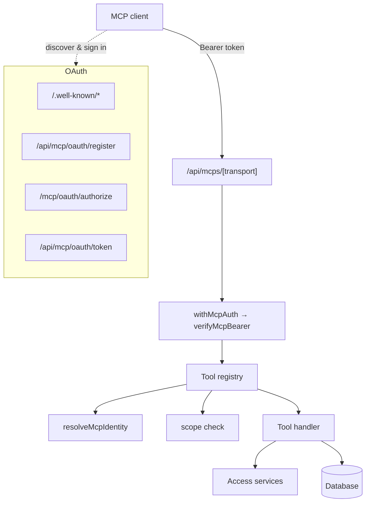

The MCP server is part of the FixtureLabs web app (a Next.js application). It is
built on `@modelcontextprotocol/sdk` and the [`mcp-handler`](https://www.npmjs.com/package/mcp-handler)
adapter, and reuses the app's existing database, auth, and access-control layers.

```
Server name      fixture-platform
Version          0.1.0
MCP endpoint     /api/mcps/mcp
Transport        Streamable HTTP (SSE disabled)
Max duration     60s per request
```

## Components



- **Endpoint** — a single dynamic route handles all MCP traffic over Streamable
  HTTP. `GET`, `POST`, and `OPTIONS` (CORS preflight) are supported. SSE-only
  transport is disabled.
- **Auth wrapper** — `withMcpAuth(..., { required: true })` rejects tokenless
  requests with `401` and a `WWW-Authenticate` header pointing at the
  protected-resource metadata.
- **Tool registry** — registers every tool, resolves identity, enforces per-tool
  scope requirements, runs the handler, and converts thrown errors into safe error
  results.
- **OAuth subsystem** — discovery documents, Dynamic Client Registration, the
  authorize/consent page, and the token endpoint.

## Request lifecycle

<Steps>
  <Step title="Token check">
    The bearer token is verified: prefix check, salted-hash lookup, not revoked,
    not expired. Last-used time is updated in the background. No token → `401`.
  </Step>
  <Step title="Identity resolution">
    For tools that act as you, the token's user id is resolved to a live user
    record (email, role). Public-tier tools skip this.
  </Step>
  <Step title="Scope enforcement">
    If the tool declares required scopes (e.g. `blog:write`), the token must carry
    them or the call is rejected with an error result.
  </Step>
  <Step title="Handler execution">
    The tool runs against the app's services and database, applying the same
    access rules (paywalls, draft visibility) the website uses.
  </Step>
  <Step title="Result">
    The handler returns a `content` array (text or JSON-as-text). Expected
    failures return `isError: true` rather than throwing.
  </Step>
</Steps>

## Transport: Streamable HTTP

The server speaks the **Streamable HTTP** MCP transport. Clients POST JSON-RPC 2.0
messages and must accept both `application/json` and `text/event-stream`, since
responses may be streamed. There is no stdio transport — local-only clients bridge
through [`mcp-remote`](/connect/cursor#stdio-only-clients).

## Data model

OAuth and token state live in four tables:

| Table | Holds |
| --- | --- |
| `mcp_tokens` | Access tokens (hashed), their scopes, owner, kind, and last-used time |
| `oauth_clients` | Registered clients and their redirect URIs |
| `oauth_authorization_codes` | Short-lived PKCE authorization codes (hashed) |
| `oauth_refresh_tokens` | Refresh tokens (hashed), rotated on use |

Tokens and codes are stored only as salted SHA-256 hashes — never in plaintext.

## Security properties

- **PKCE S256 required** for the authorization code grant; verification is
  timing-safe.
- **Public clients only** — no client secrets; security rests on PKCE.
- **Single-use, 60-second authorization codes**, consumed atomically to block
  replay.
- **Refresh-token rotation** — using a refresh token revokes it and issues a new
  pair.
- **Open-redirect protection** — the authorize page renders an error instead of
  redirecting when the client or redirect URI is invalid.
- **Redirect URI allowlist** — HTTPS, or HTTP only on loopback hosts.
- **Rate limiting** on writes and on client registration.
- **CORS** enabled so browser-based MCP clients can connect.

See [Authentication](/authentication/overview) for the flow and
[Rate limits](/reference/rate-limits) for the specific limits.
